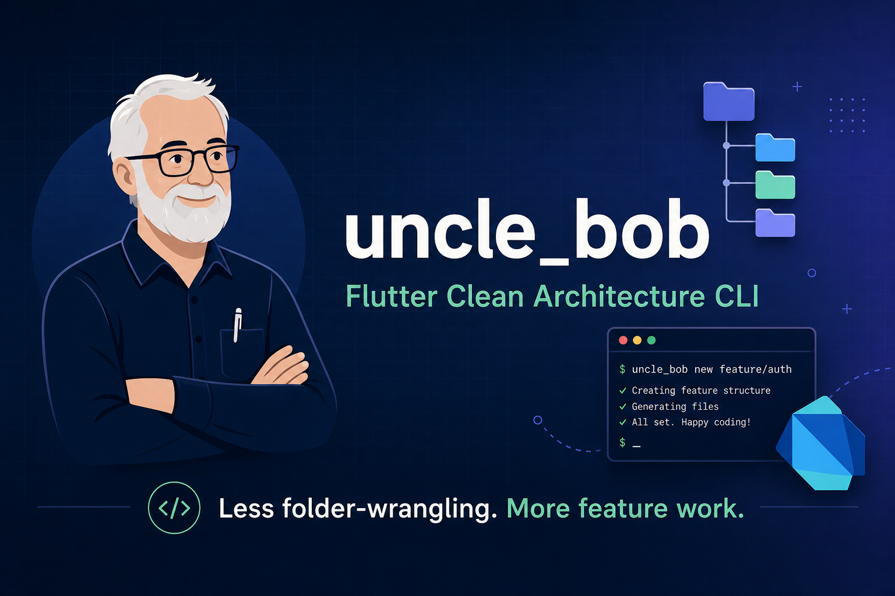
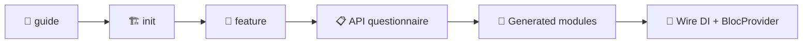

<div align="center">



<br>

[](https://pub.dev/packages/uncle_bob)
[](LICENSE)
[](https://dart.dev)
[](https://flutter.dev)

Named after [Uncle Bob](https://blog.cleancoder.com/) (Robert C. Martin).

[Install](#-install) · [Quick start](#-quick-start) · [Commands](#-commands) · [Config](#%EF%B8%8F-config) · [Roadmap](#-roadmap)

</div>

---

## ✨ What it does

`uncle_bob` bootstraps a **clean architecture** Flutter project and generates full feature modules from your real API examples.

| | |
|---|---|
| 🏗️ **`init`** | Core layers, `BaseState`, failures, use cases, DI stub |
| 🧩 **`feature`** | Data / domain / presentation scaffold per feature |
| 📋 **Questionnaire** | Paste JSON from Postman — base, data, pagination, params |
| ♻️ **Smart defaults** | Reuse base response & pagination across features |
| 📄 **API contract** | Saves `*_api_contract.json` per feature for reference |
| 🚀 **CI mode** | `--no-prompt` flags for scripts and automation |

---

## 📦 Install

```bash
dart pub global activate uncle_bob
```

Make sure pub global bin is on your `PATH`:

```bash
export PATH="$PATH:$HOME/.pub-cache/bin"   # add to ~/.zshrc
uncle_bob --help
```

<details>
<summary>🛠️ Local development (path install)</summary>

```bash
dart pub global activate --source path /path/to/uncle_bob
```

</details>

---

## 🚀 Quick start

```bash
cd my_flutter_app
uncle_bob guide                      # 📖 optional walkthrough
uncle_bob init                       # 🏗️  once per project
uncle_bob feature <feature_name>     # 🧩 e.g. settings, contacts, user_profile
```

Then paste the printed `init<Feature>()` snippet into `injection_container.dart`.



> 💡 `init` also tries to add required app dependencies via `flutter pub add`.

---

## 🧭 Commands

### 📖 `guide` — step-by-step walkthrough

```bash
uncle_bob guide
uncle_bob guide --feature    # questionnaire examples only
```

### 🏗️ `init` — bootstrap core (once per project)

Creates:

```
lib/
├── core/
│   ├── data/          errors, models, usecase, network
│   ├── domain/        entities, base responses
│   ├── functions/     RepositoryHelper
│   └── presentation/  BaseState
├── injection_container.dart
└── uncle_bob.yaml
```

### 🧩 `feature <name>` — scaffold a feature module

```
lib/features/<feature>/
├── data/
│   ├── datasources/
│   ├── models/
│   └── repositories/
├── domain/
│   ├── entities/
│   ├── params/          # paginated features
│   ├── repositories/
│   └── usecases/
├── presentation/
│   ├── blocs/
│   ├── screens/
│   └── widgets/
└── <feature>_api_contract.json
```

#### 📝 Interactive questionnaire

Each step shows an example — **press Enter to use it**, or paste your own JSON.

| Step | What you paste |
|:---:|---|
| 1️⃣ | Endpoint path |
| 2️⃣ | REST method (`GET`, `POST`, …) |
| 3️⃣ | Query params JSON *(optional)* |
| 4️⃣ | Request body JSON *(optional)* |
| 5️⃣ | Base response — `status`, `message` *(saved & reused)* |
| 6️⃣ | Data — **one list item**, not the full page |
| 7️⃣ | Paginated? `y` / `n` |
| 8️⃣ | Pagination object — usually `paginationData` *(saved & reused)* |

<details>
<summary>🔁 Reusable project defaults</summary>

Base response and pagination are stored in `uncle_bob.yaml`.  
On the next feature, uncle_bob asks if you want to **keep** or **change** them.

</details>

#### ⚡ Non-interactive mode (`--no-prompt`)

```bash
# Example: paginated list endpoint
uncle_bob feature organizations \
  --no-prompt \
  --endpoint /organizations \
  --method GET \
  --paginated \
  --params '{"search":"test"}' \
  --response-base '{"status":true,"message":"OK"}' \
  --response-data '[{"id":1,"name":"Acme"}]' \
  --pagination '{"total":129,"per_page":20,"current_page":1,"last_page":7}'
```

> `--response` / `--response-file` still work — auto-split into base / data / pagination.

---

## ⚙️ Config (`uncle_bob.yaml`)

```yaml
package_name: my_app
features_path: lib/features
core_path: lib/core
di_file: lib/injection_container.dart

# ♻️ reused across features (optional)
last_base_response_example: |
  {"status": true, "message": "OK"}
last_pagination_example: |
  {"total": 129, "per_page": 20, "current_page": 1, "last_page": 7}
last_pagination_key: paginationData
```

---

## 📚 App dependencies

`init` adds these to your Flutter app when possible:

| Package | Purpose |
|---|---|
| `dartz` | `Either` / functional errors |
| `dio` | HTTP client |
| `equatable` | Value equality |
| `flutter_bloc` | State management |
| `get_it` | Dependency injection |
| `bloc` *(dev)* | Bloc testing utilities |

Wire `initDependencies()` in `main.dart`, call each `init<Feature>()`, then expand entity/model fields from your data example *(scaffold starts with `id` + `name`)*.

---

## 🗺️ Roadmap

| Version | Goal |
|---|---|
| **v0.1** ✅ | `init` + `feature` + API questionnaire |
| **v0.2** 🔜 | `uncle_bob endpoint` per REST endpoint |
| **v0.3** 🔮 | OpenAPI / endpoint definitions |
| **Later** | VS Code extension wrapper |

---

## 🧪 Develop

```bash
git clone https://github.com/jawadabbasnia/uncle_bob.git
cd uncle_bob
dart pub get
dart test
dart analyze
dart pub publish --dry-run
dart run uncle_bob:uncle_bob --help
```

---

## 📄 License

MIT — see [LICENSE](LICENSE).

---

<div align="center">

**Built with 🧱 clean architecture in mind**

Created by **[Jawad Abbasnia](https://github.com/jawadabbasnia)**

[⭐ Star on GitHub](https://github.com/jawadabbasnia/uncle_bob) · [📦 pub.dev](https://pub.dev/packages/uncle_bob)

</div>
